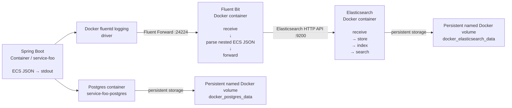

# Architecture Logging

This document describes the logging architecture used by the service-foo service/application.

It covers:

- the logging data flow from the application to Elasticsearch;
- architectural decisions and their rationale;
- storage and logs lifecycle decisions;
- tested failure scenarios and current limitations.

## ToC:
1. [Architecture Logging](#1-architecture-logging)<br>
1.1 [Logging Diagram](#11-logging-diagram)<br>
1.2 [Architecture Description](#12-architecture-description)<br>
2. [Architecture Decisions](#2-architecture-decisions)<br>
2.1 [Application Logs to stdout](#21-application-logs-to-stdout)<br>
2.2 [Docker fluentd Logging Driver](#22-docker-fluentd-logging-driver)<br>
2.3 [Fluent Bit as Log Collector](#23-fluent-bit-as-log-collector)<br>
2.4 [Elasticsearch as Log Storage](#24-elasticsearch-as-log-storage)<br>
2.5 [Named Persistent Elasticsearch Volume](#25-named-persistent-elasticsearch-volume)<br>
2.6 [Index Lifecycle Management](#26-index-lifecycle-management)<br>
2.7 [Elasticsearch Replicas](#27-elasticsearch-replicas)<br>
2.8 [Elasticsearch Disk Watermarks](#28-elasticsearch-disk-watermarks)<br>
3. [Current Tested Limitations](#3-current-tested-limitations)<br>
3.1 [Fluent Bit Outage](#31-fluent-bit-outage)<br>
3.2 [Elasticsearch Outage](#32-elasticsearch-outage)<br>
3.3 [Single Elasticsearch Node](#33-single-elasticsearch-node)<br>
3.4 [Current Delivery Guarantee](#34-current-delivery-guarantee)<br>
4. [Manual steps for setting up logging](#4-manual-steps-for-setting-up-logging)<br>

---

## 1. Architecture Logging

### 1.1 Logging Diagram



### 1.2 Architecture Description

The application writes structured logs to `stdout` using the Elastic Common Schema (ECS) JSON format.

Docker captures the container's `stdout/stderr` and sends the log records through Docker's `fluentd` logging driver. The logging driver communicates with Fluent Bit using the Fluent Forward protocol.

Fluent Bit acts as the central log collector. It receives the records, parses the ECS JSON contained in the incoming `log` field, and forwards the resulting structured document to Elasticsearch over HTTP.

Elasticsearch is responsible for storing, indexing, and searching the logs.

Application data follows a separate path:<br> 
Service `service-foo` communicates with PostgreSQL for application persistence. PostgreSQL data is stored in its own persistent Docker volume and is not part of the logging pipeline.

The logging pipeline is therefore:

```text
Spring Boot 
   ↓ 
stdout 
   ↓
Docker fluentd logging driver 
   ↓ 
Fluent Forward 
   ↓ 
Fluent Bit 
   ↓ 
Elasticsearch 
   ↓ 
persistent Elasticsearch volume
```

The application does not communicate directly with Elasticsearch.

---

## 2. Architecture Decisions

### 2.1 Application Logs to stdout

The application writes logs to `stdout/stderr` instead of writing directly to log files.

Spring Boot is configured to produce ECS-compatible JSON logs:

`logging.structured.format.console=ecs`

**Reason**

The application should not need to know where logs are ultimately stored.

The application only produces structured log events. The container/runtime infrastructure is responsible for transporting and storing those events.

This keeps the application independent from the logging backend and makes the same application logging approach usable in different environments.

---

### 2.2 Docker Fluentd Logging Driver

Docker uses the native `fluentd` logging driver:

```yml
logging:
  driver: fluentd
  options:
    fluentd-address: "127.0.0.1:24224"
    fluentd-async: "true"
    tag: "{{.Name}}"
```

The Docker logging driver sends records directly to Fluent Bit using the Fluent Forward protocol.

**Reason**

This avoids having Fluent Bit read Docker's JSON log files from:

`/var/lib/docker/containers/`

The previous file-tail approach introduced unnecessary complexity and could cause the collector to ingest its own container logs.

The native Docker logging driver provides a direct:

`container → logging collector`

No Fluentd container is used. The name `fluentd` refers to Docker's logging driver and the Fluent Forward protocol; Fluent Bit is the actual log collector.

---

### 2.3 Fluent Bit as Log Collector

Fluent Bit is used as the central log collector.

Its current responsibilities are:

1. receive log records using the Fluent Forward protocol;
2. parse the ECS JSON contained inside the incoming `log` field;
3. preserve the original record fields;
4. forward the structured document to Elasticsearch.

The application therefore does not need Elasticsearch-specific logging configuration.

**Reason**

Fluent Bit provides a lightweight and commonly used log collection layer that can receive logs from multiple services.

The architecture can therefore grow from:
```text
service-foo → Fluent Bit → Elasticsearch
```
to
```text
service-foo ─┐ 
service-bar ─┼→ Fluent Bit → Elasticsearch
service-baz ─┘
```

without requiring each application to implement its own Elasticsearch integration.

---

### 2.4 Elasticsearch as Log Storage

Elasticsearch is used as the log storage and search backend.

Logs are written through the:

`service-logs-write` write alias.

The alias currently points to:

`service-logs-000001`

The index is managed by Elasticsearch Index Lifecycle Management (ILM).

**Reason**

Elasticsearch provides structured indexing and querying of individual log fields such as:

```text
@timestamp
message
log.level
log.logger
service.name
service.version
```
This allows logs to be searched and filtered by structured fields rather than treating the entire log entry as plain text.

---

### 2.5 Named Persistent Elasticsearch Volume

Elasticsearch stores its data in the named Docker volume:

`docker_elasticsearch_data`

The volume is mounted into:

`/usr/share/elasticsearch/data`

**Reason**

Elasticsearch container recreation must not remove the stored logs.

A test was performed by:

1. indexing logs;
2. checking the document count;
3. running `docker compose down`;
4. starting the stack again;
5. checking the document count.

The logs remained available after container recreation.

This confirms that the Elasticsearch data is persisted outside the Elasticsearch container filesystem.

The volume is still subject to the available disk capacity of the host machine.

---

### 2.6 Index Lifecycle Management

Elasticsearch ILM is used to manage log index rollover and retention.

The current policy is:

```text
Rollover: 
   max_age = 24h
   max_primary_shard_size = 1GB

Retention: 
   delete after 30d
```

The rollover configuration means an index can roll over when either condition is reached:

```text
24 hours 
   OR 
1 GB primary shard size
```

The size condition is a safety mechanism to prevent an individual primary shard from growing indefinitely.

The `30-day delete phase` removes old indices according to the ILM lifecycle.

**Reason**

Log storage is naturally time-based and continuously growing.

Without rollover and retention, the Elasticsearch index would grow indefinitely.

The current policy provides:

```text
continuous ingestion 
       ↓ 
periodic rollover 
       ↓ 
old indices retained temporarily 
       ↓ 
old indices deleted after retention period
```

The current implementation uses an index alias and ILM rollover to make the rollover mechanism explicit and easy to understand in this reference project.

---

### 2.7 Elasticsearch Replicas

The index template currently specifies:

`"number_of_replicas": 1`

There is currently only one Elasticsearch node.

Therefore the cluster is expected to be:

`yellow`

because Elasticsearch cannot place a replica shard on the same node as its primary shard.

**Reason**

The replica configuration is intentionally kept at `1` because it represents the desired production topology even though the current reference environment contains only one Elasticsearch node.

With two or more Elasticsearch nodes, Elasticsearch can place the replica on another node.

A replica protects Elasticsearch data that has already been accepted and indexed by Elasticsearch.

It does not protect logs that are lost before reaching Elasticsearch.

For example:

```text
Fluent Bit 
    ↓ 
Elasticsearch node 1 
    ↓ 
primary shard 
    ↓ 
replica shard on node 2
```
protects against failure of node 1 after the document has been indexed.

It does not provide buffering for:

```text
Fluent Bit 
   ↓ 
[Elasticsearch unavailable]
```

---

### 2.8 Elasticsearch Disk Watermarks

Elasticsearch's default disk watermarks are currently used.

The defaults observed in the current environment are:

```text
low watermark: 85%
high watermark: 90%
flood stage watermark: 95%
```

Disk watermarks provide an additional protection mechanism when the Elasticsearch host approaches disk capacity.

They are independent of ILM.

ILM controls:

```text
index rollover
index retention
index deletion
```

Disk watermarks protect the Elasticsearch node when available disk space becomes low.

The current architecture does not override the default disk watermark configuration.

---

## 3. Current Tested Limitations

The following limitations are based on tests performed against the current Docker Compose environment.

These tests describe observed behavior and should not be interpreted as a guaranteed delivery contract.

---

### 3.1 Fluent Bit Outage

**Test**

1. Elasticsearch and `service-foo` were running normally.
2. Fluent Bit was stopped.
3. 100 HTTP requests were sent to `service-foo`.
4. Fluent Bit was started again.
5. Elasticsearch was monitored for incoming documents.

Result:
```text
100 requests generated 
       ↓ 
Fluent Bit unavailable 
       ↓ 
Fluent Bit restarted 
       ↓ 
delayed delivery 
       ↓ 
99/100 log documents observed
```
The missing event appeared to be the first event in the test, although the exact point of loss has not been independently established.

The important observation is that the majority of log events were delivered after Fluent Bit returned.

Delivery was delayed by approximately 30–60 seconds in the observed test.

**Interpretation**

The Docker `fluentd` logging driver provides buffering/retry behavior when Fluent Bit is temporarily unavailable.

However, the current configuration does not provide a durable, lossless logging queue.

The buffered data is not equivalent to persistent storage.

Therefore:
```text
short Fluent Bit outage
        ↓
many logs can be retained and delivered later
```
but:
```text
long outage / buffer exhaustion / host failure 
      ↓ 
log loss is possible
```
Docker documents the relevant option as `fluentd-buffer-limit`. Its default is:

> 1,048,576 events (1,048,576 log records)

When that memory buffer is full, recording another log fails. 
[Ref Docker doc](https://docs.docker.com/engine/logging/drivers/fluentd/?utm_source=chatgpt.com) 

The current architecture should therefore be considered best-effort logging, not guaranteed zero-loss logging.

The exact buffer capacity and behavior under sustained log generation have not yet been exhaustively tested.

---

### 3.2 Elasticsearch Outage

**Test**

1. Fluent Bit was running.
2. Elasticsearch was stopped.
3. Requests were sent to `service-foo`.
4. Elasticsearch was started again.
5. Logs were checked after recovery.

In the performed test, the log events generated while Elasticsearch was unavailable were not recovered after Elasticsearch restarted.

**Interpretation**

The current Fluent Bit configuration does not provide a tested durable filesystem buffer for Elasticsearch outages.

Therefore the current architecture should not be considered resilient to a complete Elasticsearch outage.

This is different from the Fluent Bit outage case:
```text
Fluent Bit outage
    ↓
Docker logging driver can buffer/retry
    ↓
some/all logs may arrive later

versus:

Elasticsearch outage
    ↓
Fluent Bit remains running
    ↓
current configuration has no tested durable queue
    ↓
logs may be lost
```

---

### 3.3 Single Elasticsearch Node

The current environment contains only one Elasticsearch node.

Therefore:
```text
primary shard → assigned
replica shard → unassigned
```
and the cluster remains `yellow` state.

This is acceptable for the local reference environment.

A multi-node Elasticsearch deployment would be required to provide actual replica placement and protection against loss of an Elasticsearch node.

---

### 3.4 Current Delivery Guarantee

The current logging architecture should be understood as:
```text 
Application 
    ↓ 
Docker fluentd logging driver 
    ↓ 
Fluent Bit 
    ↓ 
Elasticsearch
```
with **best-effort delivery**.

| Failure | Observed behavior |
|---------|------------------|
| Normal operation  | Logs delivered to Elasticsearch |
| Fluent Bit temporarily unavailable | Most tested logs were buffered/retried and delivered later |
| Fluent Bit outage, 100-event test | 99/100 events observed after recovery |
| Elasticsearch unavailable | Logs generated during the tested outage were not recovered |
| Elasticsearch container recreation | Existing logs survived because of the persistent volume |
| Elasticsearch single-node replica | Replica remains unassigned; cluster is yellow |

The architecture therefore currently prioritizes simplicity and clear separation of responsibilities over guaranteed lossless delivery.

If stronger durability is required in the future, the architecture can be extended with a **durable Fluent Bit filesystem buffer** and a multi-node Elasticsearch deployment with replicas.

---

## 4. Manual Steps for Setting Up Logging

Referenced document describes the manual steps for setting up logging to the infrastructure. 

Prerequisite is to apply `ALL` sections from 1-10 and not only section 10. for the logging setup.

Reference: [Service Manual Steps](service_manual_steps.md#10-logging-to-infrastructure)