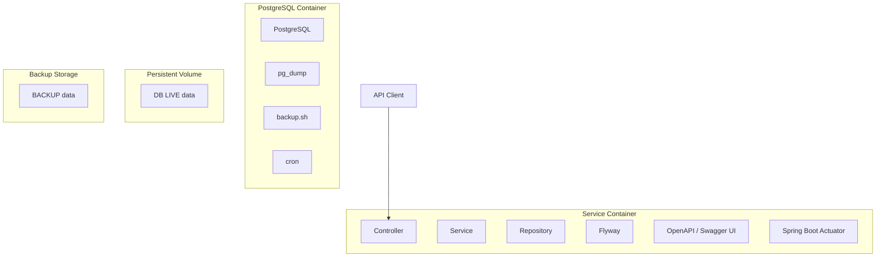

# Service Foo Architecture Overview

This document provides an overview of the architecture for the Service Foo application, including its main components, design principles, deployment model, and interactions with other services.

## Service Definition

Service Foo is a reference self-contained service within the application ecosystem.

It serves as a baseline implementation for other services, providing a common set of features and engineering standards, including:

- Java version (e.g. Java 17)
- Spring Boot
- Maven
- Testing
- Checkstyle
- SpotBugs
- CI
- Logging
- Configuration
- Health checks
- Containerization
- Application/build versioning

The reference service intentionally keeps optional infrastructure and integration features out of the baseline so that individual services can add / exchange only the capabilities they require.

### Maven Included Optinal / Infrastructure features
- Spring Boot Starter
- Spring Boot Starter Test
- Spring Boot Starter Web
- Spring Boot Starter Data JPA
- Spring Boot Starter Actuator
- PostgreSQL Driver
- Flyway
- springdoc-openapi-starter-webmvc-ui

### Maven Exclude Optional / Infrastructure features
- API (Websockets, gRPC, messaging, etc.)
- Caching (e.g., Redis)
- Messaging (e.g., Kafka, RabbitMQ)
- Security (e.g., OAuth2, JWT)
- Persistance (e.g., MongoDB, Cassandra)

## Main Components - Microservice Architecture
```
API Client
    │
    ▼
┌──────────────────────────┐
│ Service Container        │
│                          │
│ Spring Boot              │
│ ├─ Controller            │
│ ├─ Service               │
│ ├─ Repository            │
│ └─ Flyway                │
│ OpenAPI / Swagger UI     │
│ Spring Boot Actuator     │
│ 
└────────────┬─────────────┘
             │ JDBC
             ▼
┌──────────────────────────┐
│ PostgreSQL Container     │
│                          │
│ PostgreSQL               │
│ pg_dump                  │
│                          │
│ backup.sh                │
│ cron                     │──────── backup ────────┐
└────────────┬─────────────┘                        │
             │                                      ▼
             ▼                            ┌────────────────────┐
┌──────────────────────────┐              │ Backup Storage     │
│ Persistent Volume        │              │ (outside server)   │
│                          │              │                    │
│ DB LIVE data             │              │ BACKUP data        │
└──────────────────────────┘              └────────────────────┘
```



- **Service Container** → runs the Spring Boot application.
- **PostgreSQL Container** → runs PostgreSQL and has pg_dump.
- **Persistent Volume** → contains live PostgreSQL data local to the server.
- **cron + backup.sh** → periodically trigger the backup.
- **pg_dump** → reads PostgreSQL and produces the backup.
- **Backup Storage** → stores the backup outside the server.
- **Flyway** → manages database schema migrations; it is not part of the backup process.
- **OpenAPI / Swagger UI** → provides API documentation for the service.
- **Spring Boot Actuator** → exposes operational information about the running application.


## Design Principles

The Service Foo application follows several key design principles to ensure maintainability, scalability, and reliability:

- Code quality (Checkstyle, SpotBugs)
- Test coverage (Spring Boot Starter Test)
- API documentation (springdoc-openapi)
- Database migrations (Flyway)
- Observability (Spring Boot Actuator)
- Containerization (Docker)
- Versioning (Maven)    

## Interactions with Other Services

The Service Foo application interacts with other services primarily through RESTful APIs. It exposes endpoints for CRUD operations on its domain entities and consumes APIs from other services as needed. The interactions are designed to be loosely coupled, ensuring that changes in one service have minimal impact on others.

```json
{
  "service": "Service Foo",
  "interactions": [
    {
      "type": "REST",
      "endpoints": [
        "/api/foo",
        "/api/foo/{id}"
      ]
    }
  ]
}
```